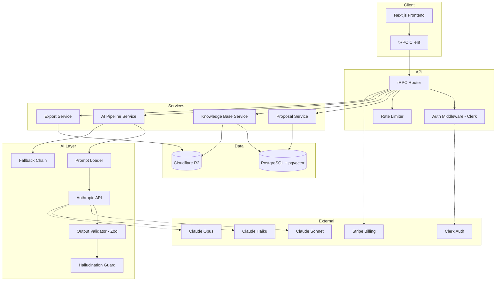
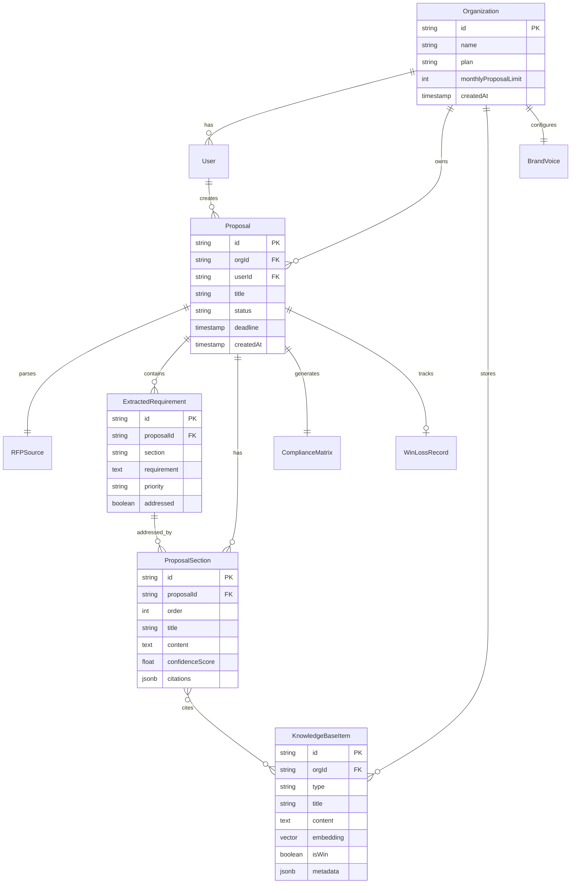

# System Architecture: ProposalPilot

## ADR-001: Monolith with Next.js App Router

**Decision**: Single Next.js 15 application with app router, not microservices.
**Rationale**: MVP speed. Monolith is correct until we need to scale individual services independently. Next.js gives us SSR, API routes, and deployment simplicity on Vercel.

## ADR-002: tRPC for API Layer

**Decision**: tRPC over REST or GraphQL.
**Rationale**: End-to-end type safety with TypeScript. No schema duplication. Faster iteration. Can always add REST endpoints later for external integrations.

## ADR-003: pgvector over Pinecone for Vector Search

**Decision**: pgvector extension on Supabase PostgreSQL.
**Rationale**: One fewer external dependency. Supabase includes pgvector. Good enough for <1M vectors. Avoids Pinecone costs and cold start latency. Can migrate to dedicated vector DB if needed at scale.

## ADR-004: Model Routing Strategy

**Decision**: Haiku for extraction/classification, Sonnet for generation, Opus for analysis.
**Rationale**: Cost optimization. Haiku handles structured extraction at 1/4 the cost. Sonnet handles the bulk of generation work. Opus reserved for complex RFP analysis and win/loss pattern detection.

## ADR-005: Tiptap for Rich Text Editor

**Decision**: Tiptap (ProseMirror-based) over Plate, Slate, or Draft.js.
**Rationale**: Best AI content injection support, collaborative editing ready, excellent extension ecosystem, active maintenance.

## System Diagram

## Data Model

## API Surface (Key Operations)

### Proposals

- `proposal.create` — Upload RFP + create proposal
- `proposal.list` — Dashboard pipeline view
- `proposal.get` — Full proposal with sections
- `proposal.updateSection` — Edit a section in the editor
- `proposal.generate` — Trigger AI generation for a section
- `proposal.regenerate` — Regenerate with different instructions
- `proposal.export` — Generate PDF/DOCX
- `proposal.setOutcome` — Mark as won/lost

### Knowledge Base

- `kb.upload` — Upload document (PDF/DOCX/text)
- `kb.list` — Browse knowledge base
- `kb.search` — Semantic search
- `kb.delete` — Remove item

### AI Pipeline

- `ai.extractRequirements` — Parse RFP into structured requirements
- `ai.matchContent` — Find relevant KB items for a requirement
- `ai.generateSection` — Draft a proposal section
- `ai.analyzeBrandVoice` — Learn voice from uploaded examples
- `ai.checkCompliance` — Verify all requirements addressed

## Security Threat Model (STRIDE — Top 3 Flows)

### Flow 1: RFP Upload + AI Processing

- **Spoofing**: Attacker uploads malicious PDF with embedded prompt injection → Mitigation: sanitize extracted text, separate system/user messages
- **Tampering**: Modified knowledge base poisoning AI output → Mitigation: content validation, audit trail on KB changes
- **Information Disclosure**: AI leaks other customer's proposals in output → Mitigation: strict tenant isolation in vector search, per-org embedding namespaces

### Flow 2: Authentication + Multi-Tenant Access

- **Spoofing**: Session hijacking → Mitigation: Clerk handles session management, httpOnly cookies
- **Elevation of Privilege**: User accesses another org's proposals → Mitigation: org-scoped queries enforced at service layer, not just API layer

### Flow 3: AI Output Delivery to Users

- **Tampering**: AI output contains fabricated case studies → Mitigation: citation validation against KB, confidence scoring, human review step
- **Denial of Service**: Cost attack via excessive AI calls → Mitigation: per-user rate limits, daily cost budgets, usage-based billing
