# Implementation Plan: ProposalPilot MVP

## Phase 1: Foundation (Day 1 morning — 3 hours)

### Task 1.1: Project Scaffolding

- **Description**: Next.js 15 app with TypeScript strict, Tailwind, shadcn/ui, project structure per CLAUDE.md
- **Acceptance Criteria**: `npm run dev` starts, `npx tsc --noEmit` passes, all directories from CLAUDE.md file organization exist
- **Dependencies**: None
- **Parallel**: No (everything depends on this)
- **Session Type**: /implement

### Task 1.2: Database Schema + Migrations

- **Description**: Prisma schema with all core models from architecture doc. Initial migration + seed.
- **Acceptance Criteria**: `npx prisma migrate dev` succeeds, `npx prisma db seed` creates test data, all models from data model section exist
- **Dependencies**: Task 1.1
- **Parallel**: No
- **Session Type**: /implement (read database skill first)

### Task 1.3: Auth + Multi-Tenancy

- **Description**: Clerk integration with organization support. Middleware protecting all routes. Org-scoped data access.
- **Acceptance Criteria**: Sign up/in works, org creation works, user sees only their org's data
- **Dependencies**: Task 1.2
- **Parallel**: No
- **Session Type**: /implement

### Task 1.4: Stripe Integration

- **Description**: 4 pricing tiers (Starter $49, Growth $199, Scale $499, Enterprise $999). Subscription management, usage tracking.
- **Acceptance Criteria**: Stripe checkout works in test mode, webhook handles subscription lifecycle, usage limits enforced
- **Dependencies**: Task 1.3
- **Parallel**: No
- **Session Type**: /implement

## Phase 2: File Processing + AI Pipeline (Day 1 afternoon — 3 hours)

### Task 2.1: File Upload + Processing Pipeline

- **Description**: Upload PDF/DOCX, extract text, chunk for embedding. Store originals in R2.
- **Acceptance Criteria**: Upload a real RFP PDF, text extracted correctly, stored in R2, chunks created
- **Dependencies**: Task 1.2
- **Parallel**: Yes (independent of Phase 1.3-1.4)
- **Session Type**: /implement

### Task 2.2: Knowledge Base + Vector Search

- **Description**: Upload past proposals/case studies, generate embeddings, store in pgvector, semantic search endpoint.
- **Acceptance Criteria**: Upload 3 sample proposals, search "healthcare project with tight deadline" returns relevant results
- **Dependencies**: Task 2.1
- **Parallel**: No
- **Session Type**: /implement (read ai-integration skill first)

### Task 2.3: Requirement Extraction Prompt

- **Description**: Design, version, and implement the requirement extractor. Haiku model, structured JSON output.
- **Acceptance Criteria**: Feed sample RFP, get structured requirements with section, priority, and full text. Eval score >0.85 on test set.
- **Dependencies**: Task 2.1
- **Parallel**: Yes (independent of 2.2)
- **Session Type**: /prompt-engineer

### Task 2.4: Section Generation Prompt

- **Description**: Design, version, and implement the proposal section generator. Sonnet model, brand-voice-aware.
- **Acceptance Criteria**: Given a requirement + KB context + brand voice, generates a coherent section. Eval score >0.80.
- **Dependencies**: Task 2.2, Task 2.3
- **Parallel**: No
- **Session Type**: /prompt-engineer

## Phase 3: Core Product (Day 2 morning — 3 hours)

### Task 3.1: Proposal Editor (Tiptap)

- **Description**: Rich text editor with AI-generated content injection, section-by-section editing, requirement sidebar.
- **Acceptance Criteria**: Editor loads, can insert AI content, edit text, reorder sections. Autosaves.
- **Dependencies**: Task 2.4
- **Parallel**: No
- **Session Type**: /design-ui

### Task 3.2: Proposal Generation Flow (End-to-End)

- **Description**: Complete flow: upload RFP → extract requirements → match KB → generate sections → display in editor.
- **Acceptance Criteria**: Upload real RFP, see requirements extracted, click "generate", see full proposal draft in editor.
- **Dependencies**: Task 3.1
- **Parallel**: No
- **Session Type**: /implement

### Task 3.3: Export Engine

- **Description**: Generate branded PDF and DOCX from editor content. Professional formatting with logo, headers, footers.
- **Acceptance Criteria**: Click export, get a PDF that looks professional. Click export DOCX, get editable Word doc.
- **Dependencies**: Task 3.1
- **Parallel**: Yes (while 3.2 is being tested)
- **Session Type**: /implement

## Phase 4: UI + Polish (Day 2 afternoon — 2 hours)

### Task 4.1: Dashboard + Navigation

- **Description**: Proposal pipeline view (draft/in-progress/sent/won/lost), knowledge base browser, settings.
- **Acceptance Criteria**: Dashboard shows all proposals with status, click to open, filter by status. Responsive.
- **Dependencies**: Task 3.2
- **Parallel**: No
- **Session Type**: /design-ui

### Task 4.2: Onboarding Flow

- **Description**: First-time experience: upload 3+ past proposals, configure brand voice, see first AI-generated output.
- **Acceptance Criteria**: New user sees onboarding, uploads docs, brand voice configured, demo proposal generated. Takes <5 minutes.
- **Dependencies**: Task 4.1
- **Parallel**: No
- **Session Type**: /design-ui

### Task 4.3: Brand Voice Configuration

- **Description**: Upload 5-10 past proposals, AI analyzes tone/style/terminology, produces a brand voice profile.
- **Acceptance Criteria**: Upload 5 proposals, see extracted voice characteristics, test generation with/without voice — voice version sounds like the originals.
- **Dependencies**: Task 2.2
- **Parallel**: Yes
- **Session Type**: /prompt-engineer

## Phase 5: Quality Gates (Day 2 evening — 2 hours)

### Task 5.1: Test Suite

- **Dependencies**: All Phase 3 tasks
- **Session Type**: /test

### Task 5.2: Code Review

- **Dependencies**: Task 5.1
- **Session Type**: /review

### Task 5.3: Security Audit

- **Dependencies**: Task 5.2
- **Session Type**: /security

### Task 5.4: Monitoring Setup

- **Dependencies**: Task 5.3
- **Session Type**: /monitor

### Task 5.5: Ship

- **Dependencies**: Task 5.4
- **Session Type**: /ship

## Timeline (Gantt)

```mermaid
gantt
    title ProposalPilot MVP — 2 Day Build
    dateFormat HH:mm
    axisFormat %H:%M

    section Day 1 Morning
    Scaffolding           :t11, 09:00, 45m
    Database + Migrations :t12, after t11, 45m
    Auth + Multi-Tenancy  :t13, after t12, 45m
    Stripe Integration    :t14, after t13, 45m

    section Day 1 Afternoon
    File Upload Pipeline  :t21, 13:00, 60m
    Knowledge Base        :t22, after t21, 60m
    Requirement Prompt    :t23, 13:00, 60m
    Section Gen Prompt    :t24, after t22, 60m

    section Day 2 Morning
    Proposal Editor       :t31, 09:00, 60m
    E2E Generation Flow   :t32, after t31, 60m
    Export Engine          :t33, 09:00, 60m

    section Day 2 Afternoon
    Dashboard + Nav       :t41, 13:00, 45m
    Onboarding Flow       :t42, after t41, 45m
    Brand Voice           :t43, 13:00, 45m

    section Quality Gates
    Tests                 :t51, 15:00, 30m
    Review                :t52, after t51, 20m
    Security              :t53, after t52, 20m
    Monitor               :t54, after t53, 15m
    Ship                  :t55, after t54, 15m
```

**Total estimated time**: ~13 hours across 2 days (including parallel sessions)
**Critical path**: Scaffolding → DB → File Upload → KB → Section Gen → Editor → E2E Flow → Dashboard → Tests → Ship
