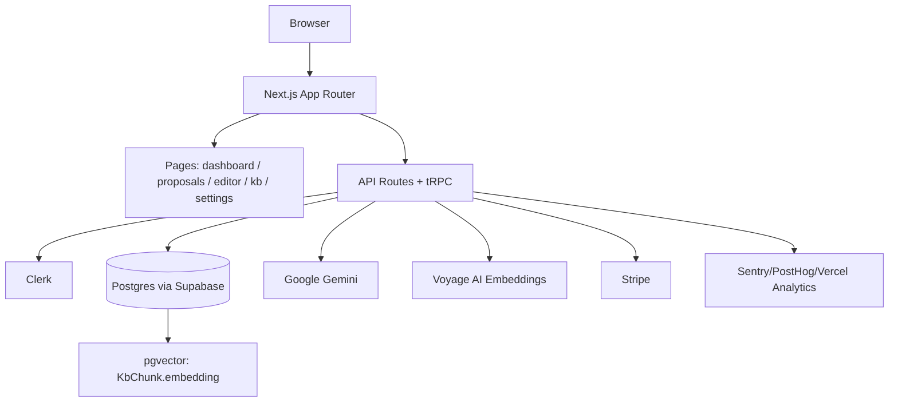

# System Map

## Stack Profile
- Language: TypeScript
- Framework: Next.js (App Router) `16.2.1`
- Package Manager: npm
- ORM/Database: Prisma + PostgreSQL (Supabase) + pgvector
- Deploy Target: Vercel (inferred from env + analytics IDs)
- Test Runner: Jest (unit) + Playwright (e2e)

## Feature Inventory
| Route | Type | Description | Complexity |
|---|---|---|---|
| `/` | Page | Marketing landing page | Simple |
| `/sign-in/[[...sign-in]]` | Page | Auth sign-in (Clerk) | Moderate |
| `/sign-up/[[...sign-up]]` | Page | Auth sign-up (Clerk) | Moderate |
| `/onboarding` | Page | First-run onboarding wizard | Moderate |
| `/dashboard` | Page | App dashboard | Moderate |
| `/proposals` | Page | Proposal list | Moderate |
| `/proposals/[id]` | Page | Proposal editor (Tiptap + streaming generation) | Complex |
| `/knowledge-base` | Page | Knowledge base upload/search UI | Complex |
| `/settings` | Page | Settings overview | Simple |
| `/settings/brand-voice` | Page | Brand voice profile management | Moderate |
| `/api/health` | API | Health check | Simple |
| `/api/upload` | API | Upload endpoint (RFP) | Complex |
| `/api/upload/kb` | API | KB upload/ingestion | Complex |
| `/api/ai/stream-section` | API | Streams AI-generated section content | Complex |
| `/api/webhooks/stripe` | API | Stripe webhook handler | Complex |
| `/api/trpc/[trpc]` | API | tRPC endpoint | Complex |

Total: 10 pages, 6 API routes, 0 middleware

## Integration Map
| Service | Provider | Env Var | Status |
|---|---|---|---|
| Authentication | Clerk | `NEXT_PUBLIC_CLERK_PUBLISHABLE_KEY`, `CLERK_SECRET_KEY` | Required |
| Payments | Stripe | `STRIPE_SECRET_KEY`, `STRIPE_WEBHOOK_SECRET`, `NEXT_PUBLIC_STRIPE_PUBLISHABLE_KEY`, `STRIPE_PRICE_*` | Partially wired (webhook + prices) |
| Database | Supabase Postgres | `DATABASE_URL`, `DIRECT_URL` | Required |
| Vector search | pgvector | (DB extension) | Required for embeddings workflow |
| LLM (generation/extraction) | Google Gemini | `GOOGLE_GEMINI_API_KEY` | Required |
| Embeddings | Voyage AI | `VOYAGE_API_KEY` | Optional (fallback to full-text if unset) |
| Error monitoring | Sentry | `SENTRY_DSN` | Optional |
| Analytics | PostHog | `NEXT_PUBLIC_POSTHOG_KEY` | Optional |
| Analytics | Vercel | `VERCEL_ANALYTICS_ID` | Optional |

## Data Model Summary (Prisma)
| Model | Fields | Relations | Notes |
|---|---:|---:|---|
| `Organization` | 12 | 0 | Tenant boundary (Clerk org id, plan, Stripe customer) |
| `User` | 7 | 1 | Clerk user mapping; belongs to `Organization` |
| `Proposal` | 16 | 2 | Core entity; status, deadline; rich relation graph |
| `RFPSource` | 11 | 1 | Uploaded RFP source + extracted text |
| `ExtractedRequirement` | 8 | 2 | Requirements extracted from RFP |
| `ProposalSection` | 12 | 3 | Generated sections + citations + confidence |
| `ComplianceMatrix` | 6 | 1 | JSON compliance matrix + score |
| `WinLossRecord` | 8 | 1 | Outcome tracking |
| `KnowledgeBaseItem` | 14 | 2 | KB documents; chunks + citation relation |
| `KbChunk` | 8 | 1 | Per-chunk embeddings (vector(1024)) |
| `ProcessedWebhookEvent` | 3 | 0 | Stripe webhook idempotency |
| `BrandVoice` | 7 | 1 | Brand voice profile per org |

Total: 12 models, 15 relation fields

## System Diagram

## Complexity Assessment
- Total routes: 16 (10 pages + 6 API)
- Total integrations: 9 (auth, payments, db, vector, llm, embeddings, monitoring, analytics)
- Total data models: 12
- Estimated codebase complexity: MEDIUM
- Recommended rescue ceremony: STANDARD

